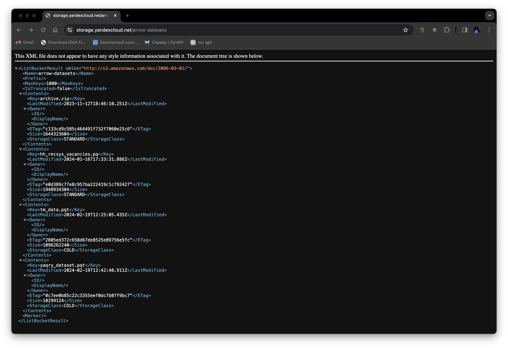
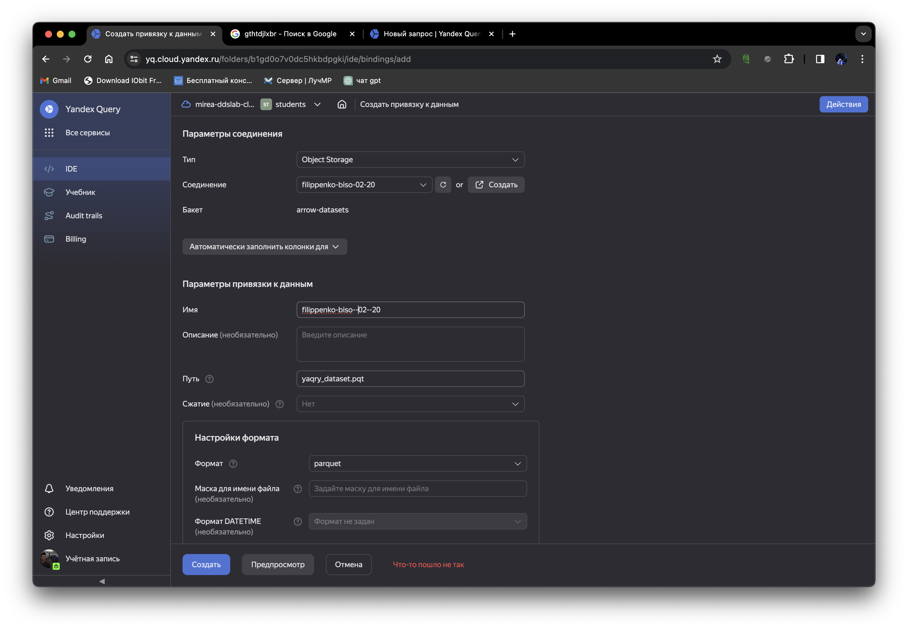
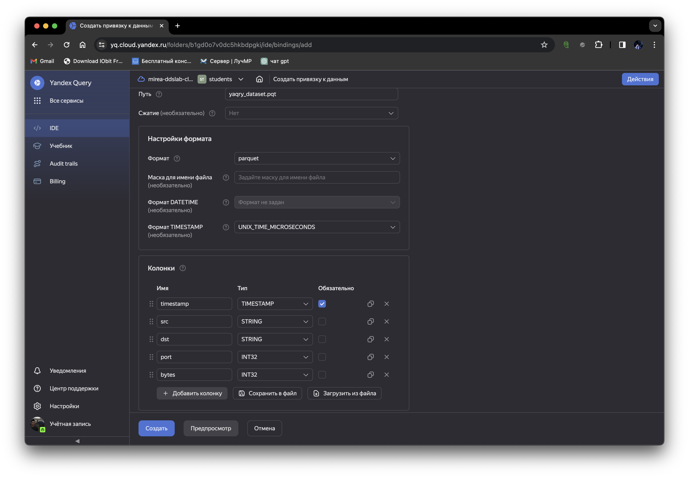
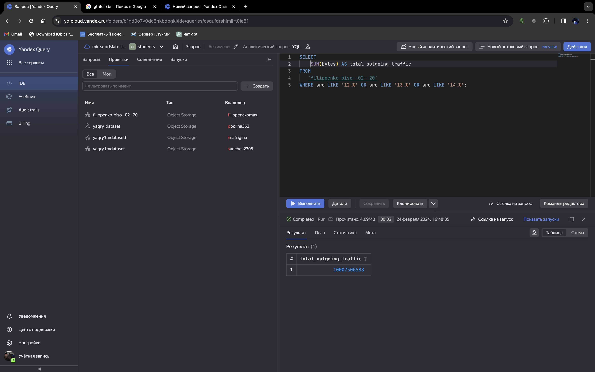

# Использование технологии Yandex Query для анализа данных сетевой активности
Филиппенко Максим Дмитриевич БИСО-02-20

## Цель работы:

Освоить основы работы с технологией Yandex Query для анализа данных
сетевой активности

## Задание:

1.  Известно, что IP адреса внутренней сети начинаются с октетов,
    принадлежащих интервалу \[12-14\]. Определите количество хостов
    внутренней сети, представленных в датасете.
2.  Определите суммарный объем исходящего трафика
3.  Определите суммарный объем входящего трафика

## Ход работы:

#### 1. Проверить доступность данных в Yandex Object Storage



Из ответа от сайта мы получаем информацию о том, что данный бакет
доступен для использования.

#### 2. Подключить бакет как источник данных для Yandex Query

1.  Создаю соедниение для бакета в S3 хранилище


1.  Указываю какой объект будет использоваться в качестве источника
    данных

 

#### 3. Используя встроенную в Yandex Query ide составить запрос для определения кол-ва хостов:

``` sql
SELECT 
    COUNT(DISTINCT src) AS internal_hosts_count
FROM
   `filippenko-biso--02--20`
WHERE src LIKE '12.%' OR src LIKE '13.%' OR src LIKE '14.%';
```


#### 4. Используя встроенную в Yandex Query ide составить запрос для определения суммарного объема исходящего трафика:

``` sql
SELECT 
    SUM(bytes) AS total_outgoing_traffic
FROM
   `filippenko-biso--02--20`
WHERE src LIKE '12.%' OR src LIKE '13.%' OR src LIKE '14.%';
```



#### 5. Используя встроенную в Yandex Query ide составить запрос для определения суммарного объема входящего трафика:

``` sql
SELECT 
    SUM(bytes) AS total_incoming_traffic
FROM
   `filippenko-biso--02--20`
WHERE dst LIKE '12.%' OR dst LIKE '13.%' OR dst LIKE '14.%';
```


## Вывод:

В ходе проделанной работы, освоил основные навыки для работы с
технологией Yandex Query
